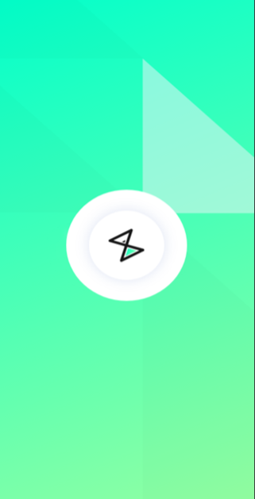
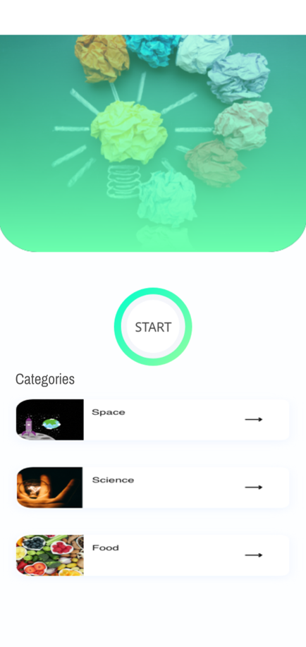
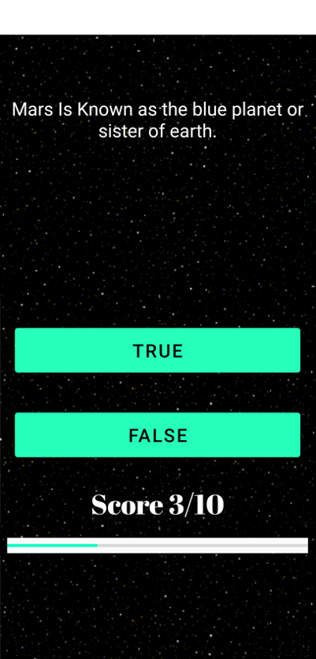
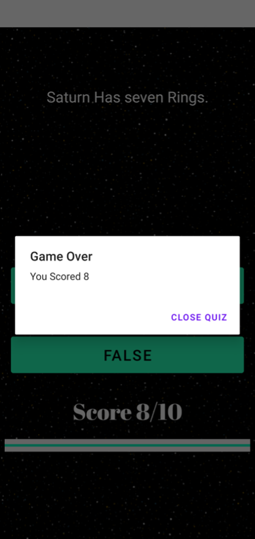

#  Quizzler -

This project was build as a part of Android App Development course provided by the startup company Golden Bird Learning Pvt. Ltd. It was used to teach engineering undergraduate students how to make a quiz android app with multiple screens, buttons and layouts (constraint, linear, etc). It is a simple quiz game, where there is one set of pre defined questions and the player has to answer each of them. These questions have been divided into three categories, namely Space, Science and Food. Clicking pn these buttons starts the respective quiz. Clicking on the Start button, on the home page, starts a quiz category randomly. The player answers each question and the score increases or remains constant accordingly if the answer is correct or not.
 
## App Images -

 &nbsp; &nbsp;
 
 &nbsp; &nbsp;
 

